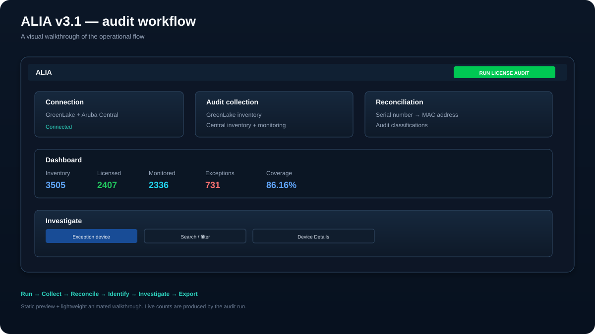
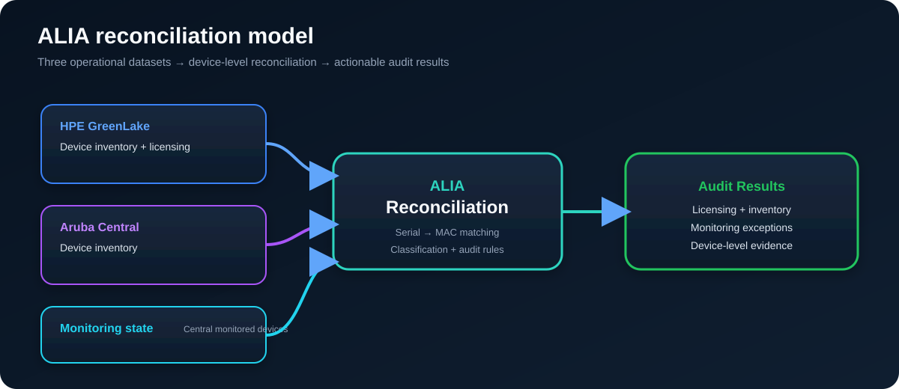
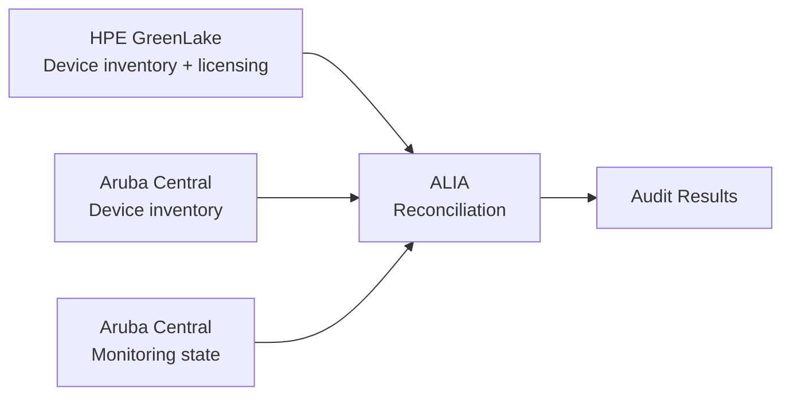

# ALIA

## Aruba License Inventory Audit

**ALIA (Aruba License Inventory Audit)** is an open-source Windows PowerShell application for auditing and reconciling **Aruba device inventory and licensing across HPE GreenLake and Aruba Central**.

It helps network and infrastructure teams identify **licensed devices missing from Aruba Central, devices that are not monitored, expired licenses, unlicensed devices, inventory mismatches, and other license reconciliation exceptions**.

ALIA combines HPE GreenLake inventory and licensing, Aruba Central inventory, and Aruba Central monitored-device state, then correlates devices primarily by **serial number** and secondarily by **MAC address** to produce a device-level audit.

**Project website:** https://prathameshhankare.github.io/ALIA/  
**Technical guide:** https://prathameshhankare.github.io/ALIA/aruba-license-audit-greenlake-aruba-central.html  
**GitHub:** https://github.com/PrathameshHankare/ALIA

---

## What problem does ALIA solve?

Aruba environments can represent inventory, licensing and monitoring information across multiple systems. ALIA brings those datasets into one repeatable reconciliation workflow so teams can move from raw inventories to actionable, device-level evidence.

Typical questions ALIA helps answer:

- Which Aruba devices are licensed in HPE GreenLake?
- Which licensed devices are missing from Aruba Central?
- Which licensed devices are not present in Central monitored-device data?
- Which licenses are expired?
- Which devices appear in Central but do not have GreenLake license information?
- Which reconciliation exceptions need investigation?

---

## Use cases

### Aruba license audit

Review Aruba device licensing using HPE GreenLake license and inventory information.

### Aruba Central inventory reconciliation

Compare HPE GreenLake device inventory against Aruba Central inventory.

### Aruba monitoring reconciliation

Identify licensed devices that are missing from Aruba Central monitored-device data.

### Network inventory cleanup

Find devices that are present in one operational system but inconsistent or absent in another.

### Repeatable operational reporting

Run the audit repeatedly, investigate the current view, export the current results, and retain previous audit metrics locally.

---

## v3.2 Preview




v3.2 keeps the v3.1 dark Windows Forms workspace and audit behavior, with additional DPI-aware layout handling for different display scales and window sizes.

> The preview uses representative audit values for presentation; live counts are produced by the audit run.

---

## What's new in v3.2

v3.2 preserves the v3.1 workspace and reconciliation behavior while improving layout compatibility across display scaling and viewport sizes.

- Enables Per-Monitor V2 DPI awareness when Windows supports it, with fallbacks for older systems.
- Scales layout coordinates from a shared 96-DPI design baseline.
- Reflows the connection cards, Audit Health panel, KPI cards, search toolbar, device details, progress row, and Audit History dialog for the active DPI and available space.
- Handles the WinForms `DpiChanged` event so layout can be recalculated when the window moves between displays.
- Records the effective DPI scale in the audit log for troubleshooting.

The target remains Windows PowerShell 5.1 and WinForms. The preview images below show the retained v3.1 visual design.

## Audit Workspace features introduced in v3.1

The v3.1 redesign provides the workspace and audit features retained by v3.2.

### Audit workspace

- Audit Health summary with **Healthy / Warning / Critical** counts
- Reconciliation **Coverage** metric
- Six compact KPI cards:
  - GreenLake Inventory
  - Central Inventory
  - Central Monitored
  - Licensed Devices
  - Exceptions
  - Expired Licenses
- Audit-over-audit trend indicators on KPI cards
- Primary **Run License Audit** workflow
- GreenLake and Aruba Central connection cards with connection state and secret show/hide controls
- Responsive enterprise layout
- Dark Windows application theme with native dark title-bar handling

### Audit results

The main audit grid provides:

- Full-row, read-only reconciliation results
- Frozen identity columns
- Click-to-sort column headers
- Right-click column-header filtering
- Multi-value per-column filters
- Clear-all column filters
- Visual indication of filtered columns
- Global device search
- Quick **All / raw reconciliation** view
- Device-type and reconciliation views
- Device detail pane showing GreenLake, Aruba Central, monitoring, licensing, and audit state
- Copy Cell / Row / Serial / MAC actions

### Search and export

The search box starts with \`Search devices...\` and uses a debounce interval so the grid does not refresh on every keystroke while a user is still typing.

**Export** operates on the **current audit view**, so active view/filter/search state is preserved instead of exporting the entire unfiltered dataset.

### Audit history and diagnostics

- Collapsible audit log
- Detailed audit logging
- Persistent audit history under the current user's \`LocalApplicationData\`
- Audit History dialog with previous-run metrics
- Status bar with:
  - Last audit
  - Duration
  - Coverage
- Progress/status feedback during API collection and reconciliation

### Keyboard shortcuts

| Shortcut | Action |
|---|---|
| \`F5\` | Run License Audit |
| \`Ctrl+L\` | Toggle Audit Log |

---

## What ALIA does

ALIA currently provides this workflow:

1. Test connectivity to HPE GreenLake and Aruba Central.
2. Retrieve HPE GreenLake device inventory.
3. Retrieve Aruba Central device inventory.
4. Retrieve Aruba Central monitored-device information.
5. Normalize and match devices primarily by **serial number** and secondarily by **MAC address**.
6. Reconcile GreenLake licensing against Aruba Central inventory and monitoring state.
7. Classify reconciliation conditions and exceptions.
8. Present summary metrics and device-level audit results.
9. Preserve audit history and detailed operational logs.
10. Allow searching, filtering and CSV export of the current audit view.

---

## Architecture



## Reconciliation model

ALIA combines three logical datasets:



The audit can identify conditions including:

- GreenLake licensed devices
- GreenLake devices without a license
- Expired GreenLake licenses
- Licensed devices not provisioned in Central
- Licensed devices not present in Central monitored-device data
- Central inventory devices that are not monitored
- GreenLake-unlicensed devices that appear in monitored data
- Other reconciliation mismatches surfaced by the audit engine

The dashboard provides the operational summary; the audit grid provides device-level evidence and the device detail pane explains the selected record.

---
## Dashboard

The v3.1 dashboard exposes these primary counters:

| Dashboard item | Purpose |
|---|---|
| GreenLake Inventory | Total devices returned from GreenLake |
| Central Inventory | Total devices returned from Aruba Central inventory |
| Central Monitored | Total devices returned from Central monitored-device data |
| Licensed Devices | GreenLake devices with license information according to the audit |
| Exceptions | Devices requiring reconciliation attention |
| Expired Licenses | Devices identified with expired licensing |

The Audit Health panel summarizes:

| Metric | Meaning |
|---|---|
| Healthy | Records classified as healthy by the audit engine |
| Warning | Records requiring attention but not classified as critical |
| Critical | Records requiring critical attention |
| Coverage | Reconciliation coverage percentage |

Live counts are produced by each audit run and should not be treated as fixed application values.

---

## Requirements

ALIA v3.2 targets:

- Windows
- **Windows PowerShell 5.1**
- Windows Forms
- Network access to the configured HPE GreenLake and Aruba Central API endpoints
- API client credentials for the respective services

The script is also documented as compatible with **PowerShell ISE**.

---

## Running ALIA

Run the canonical v3.2 source from Windows PowerShell 5.1:

```powershell
Set-ExecutionPolicy -Scope Process -ExecutionPolicy Bypass
.\\ALIA-v3.2.ps1
```

Credentials are entered at runtime through the GUI.

> Do not place client secrets directly into the PowerShell source code.

---

## Building the Windows EXE

The repository includes the production v3.2 EXE builder:

```powershell
Set-ExecutionPolicy -Scope Process -ExecutionPolicy Bypass
.\\Build-ALIA-v3.2.ps1
```

The builder:

- Uses **PS2EXE**
- Packages the canonical \`ALIA-v3.2.ps1\` source
- Produces a 64-bit GUI-only Windows executable
- Enables DPI-aware metadata
- Generates and embeds the application icon
- Places the output under \`dist\`

Output:

```text
dist\\ALIA-v3.2.exe
```

The \`dist\` directory and generated executables are excluded from Git.

---

## Security and credential handling

ALIA is designed so that service credentials are supplied at runtime.

According to the application implementation:

- Client IDs and Client Secrets are entered through the GUI.
- Credentials are not written to the audit log.
- Credentials are not exported to CSV.
- API endpoints are configured internally by the application.
- Audit logs are written to the \`Logs\` directory next to the application/script location when possible.

Before production deployment, review the configured endpoints, credentials handling, logging behavior, and change-management requirements against your organization's security standards.

---

## Project structure

```text
ALIA/
├── ALIA-v3.2.ps1                         # Canonical v3.2 application
├── Build-ALIA-v3.2.ps1                   # Production v3.2 EXE builder
├── CHANGELOG-v3.2.md                     # v3.2 release notes
├── docs/
│   ├── index.html                        # GitHub Pages project site
│   ├── aruba-license-audit-greenlake-aruba-central.html
│   ├── architecture.svg                  # Reconciliation architecture diagram
│   ├── ALIA-v3.1-preview.svg             # Final GUI preview
│   ├── ALIA-v3.1-demo.svg                # Workflow demo visualization
│   ├── sitemap.xml
│   ├── robots.txt
│   └── 404.html
├── .github/
│   └── workflows/
│       ├── deploy-pages.yml              # GitHub Pages deployment
│       ├── validate-v3.1.yml             # v3.1 validation
│       └── validate-v3.2.yml             # v3.2 validation
├── README.md
├── LICENSE
└── .gitignore
```

Generated EXE/build output and runtime audit logs are intentionally excluded from Git.

---

## Version and release status

**Current application version on this branch:** \`v3.2.0\`

The canonical v3.2 source is \`ALIA-v3.2.ps1\`; the corresponding builder is \`Build-ALIA-v3.2.ps1\`.

The repository maintains \`main\`, \`v3.0\`, \`v3.1\`, and \`v3.2\` branches.

---

## Validation

The v3.2 GitHub Actions validation workflow checks:

- PowerShell syntax
- Error-severity PSScriptAnalyzer findings
- Required GUI features
- Grid sorting/filtering features
- Required v3.2 DPI and responsive layout functions
- Production EXE build
- EXE existence and non-zero output size

The v3.2 workflow runs on pushes and pull requests targeting the \`v3.2\` branch. Check the Actions tab for the latest result.

---

## Development notes

ALIA remains a single PowerShell/Windows Forms application so it can be deployed in environments where installing a separate application runtime is undesirable.

Long-running inventory and reconciliation operations use background execution/runspace handling so the GUI can remain responsive during API collection.

The dashboard and audit grid are intended to support operational review and reconciliation; they do not replace the authoritative HPE GreenLake or Aruba Central systems.

---

## Project website and technical guide

ALIA has a dedicated static project site for people who discover the tool through search rather than directly through GitHub:

- **Project site:** https://prathameshhankare.github.io/ALIA/
- **Technical guide:** https://prathameshhankare.github.io/ALIA/aruba-license-audit-greenlake-aruba-central.html

The site explains the reconciliation model, common use cases, workflow, audit conditions, deployment model, and FAQ.

---

## Repository

GitHub:

\`https://github.com/PrathameshHankare/ALIA\`

---

## Author

**Prathamesh Hankare**

Network & Security Engineering

---

## License

ALIA is distributed under the **GNU General Public License v3.0**. See [LICENSE](LICENSE) for the complete license text.
