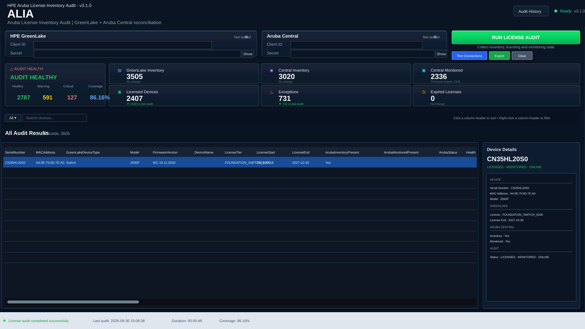
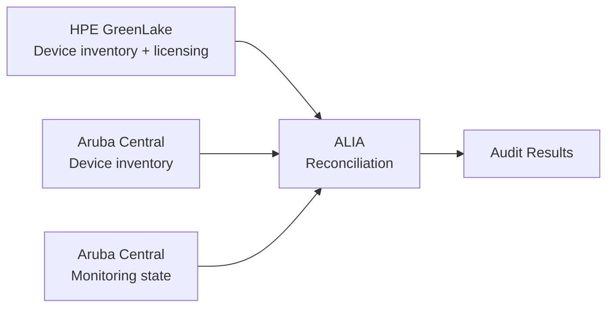

# ALIA

## Aruba License Inventory Audit

**ALIA (Aruba License Inventory Audit)** is an enterprise-oriented Windows PowerShell application for reconciling **HPE GreenLake device inventory and licensing** with **Aruba Central inventory and monitoring state**.

ALIA is designed for infrastructure and network teams that need a single operational view of licensing, inventory presence, monitoring state, and reconciliation exceptions.

## v3.1 Preview



The v3.1 workspace uses a dark enterprise-style Windows Forms interface with a dashboard summary, audit health, KPI cards, searchable and filterable audit results, and a device detail pane.

> The preview uses representative audit values for presentation; live counts are produced by the audit run.

---

## What's new in v3.1

v3.1 is the redesigned **Audit Workspace** while retaining the existing v3.0 API and reconciliation engine.

### Audit workspace

- Audit Health summary with **Healthy / Warning / Critical** counts
- Reconciliation **Coverage** metric
- Six compact KPI cards:
  - GreenLake Inventory
  - Central Inventory
  - Central Monitored
  - Licensed Devices
  - Exceptions
  - Expired Licenses
- Audit-over-audit trend indicators on KPI cards
- Primary **Run License Audit** workflow
- GreenLake and Aruba Central connection cards with connection state and secret show/hide controls
- Responsive enterprise layout
- Dark Windows application theme with native dark title-bar handling

### Audit results

The main audit grid provides:

- Full-row, read-only reconciliation results
- Frozen identity columns
- Click-to-sort column headers
- Right-click column-header filtering
- Multi-value per-column filters
- Clear-all column filters
- Visual indication of filtered columns
- Global device search
- Quick **All / raw reconciliation** view
- Device-type and reconciliation views
- Device detail pane showing GreenLake, Aruba Central, monitoring, licensing, and audit state
- Copy Cell / Row / Serial / MAC actions

### Search and export

The search box starts with \`Search devices...\` and uses a debounce interval so the grid does not refresh on every keystroke while a user is still typing.

**Export** operates on the **current audit view**, so active view/filter/search state is preserved instead of exporting the entire unfiltered dataset.

### Audit history and diagnostics

- Collapsible audit log
- Detailed audit logging
- Persistent audit history under the current user's \`LocalApplicationData\`
- Audit History dialog with previous-run metrics
- Status bar with:
  - Last audit
  - Duration
  - Coverage
- Progress/status feedback during API collection and reconciliation

### Keyboard shortcuts

| Shortcut | Action |
|---|---|
| \`F5\` | Run License Audit |
| \`Ctrl+L\` | Toggle Audit Log |

---

## What ALIA does

ALIA currently provides this workflow:

1. Test connectivity to HPE GreenLake and Aruba Central.
2. Retrieve HPE GreenLake device inventory.
3. Retrieve Aruba Central device inventory.
4. Retrieve Aruba Central monitored-device information.
5. Normalize and match devices primarily by **serial number** and secondarily by **MAC address**.
6. Reconcile GreenLake licensing against Aruba Central inventory and monitoring state.
7. Classify reconciliation conditions and exceptions.
8. Present summary metrics and device-level audit results.
9. Preserve audit history and detailed operational logs.
10. Allow searching, filtering and CSV export of the current audit view.

---

## Reconciliation model

ALIA combines three logical datasets:



The audit can identify conditions including:

- GreenLake licensed devices
- GreenLake devices without a license
- Expired GreenLake licenses
- Licensed devices not provisioned in Central
- Licensed devices not present in Central monitored-device data
- Central inventory devices that are not monitored
- GreenLake-unlicensed devices that appear in monitored data
- Other reconciliation mismatches surfaced by the audit engine

The dashboard provides the operational summary; the audit grid provides device-level evidence and the device detail pane explains the selected record.

---
## Dashboard

The v3.1 dashboard exposes these primary counters:

| Dashboard item | Purpose |
|---|---|
| GreenLake Inventory | Total devices returned from GreenLake |
| Central Inventory | Total devices returned from Aruba Central inventory |
| Central Monitored | Total devices returned from Central monitored-device data |
| Licensed Devices | GreenLake devices with license information according to the audit |
| Exceptions | Devices requiring reconciliation attention |
| Expired Licenses | Devices identified with expired licensing |

The Audit Health panel summarizes:

| Metric | Meaning |
|---|---|
| Healthy | Records classified as healthy by the audit engine |
| Warning | Records requiring attention but not classified as critical |
| Critical | Records requiring critical attention |
| Coverage | Reconciliation coverage percentage |

Live counts are produced by each audit run and should not be treated as fixed application values.

---

## Requirements

ALIA v3.1 targets:

- Windows
- **Windows PowerShell 5.1**
- Windows Forms
- Network access to the configured HPE GreenLake and Aruba Central API endpoints
- API client credentials for the respective services

The script is also documented as compatible with **PowerShell ISE**.

---

## Running ALIA

Run the canonical v3.1 source from Windows PowerShell 5.1:

```powershell
Set-ExecutionPolicy -Scope Process -ExecutionPolicy Bypass
.\\ALIA-v3.1.ps1
```

Credentials are entered at runtime through the GUI.

> Do not place client secrets directly into the PowerShell source code.

---

## Building the Windows EXE

The repository includes the production v3.1 EXE builder:

```powershell
Set-ExecutionPolicy -Scope Process -ExecutionPolicy Bypass
.\\Build-ALIA-v3.1.ps1
```

The builder:

- Uses **PS2EXE**
- Packages the canonical \`ALIA-v3.1.ps1\` source
- Produces a 64-bit GUI-only Windows executable
- Enables DPI-aware metadata
- Generates and embeds the application icon
- Places the output under \`dist\`

Output:

```text
dist\\ALIA-v3.1.exe
```

The \`dist\` directory and generated executables are excluded from Git.

---

## Security and credential handling

ALIA is designed so that service credentials are supplied at runtime.

According to the application implementation:

- Client IDs and Client Secrets are entered through the GUI.
- Credentials are not written to the audit log.
- Credentials are not exported to CSV.
- API endpoints are configured internally by the application.
- Audit logs are written to the \`Logs\` directory next to the application/script location when possible.

Before production deployment, review the configured endpoints, credentials handling, logging behavior, and change-management requirements against your organization's security standards.

---

## Project structure

```text
ALIA/
├── ALIA-v3.1.ps1          # Canonical v3.1 application
├── Build-ALIA-v3.1.ps1    # Production v3.1 EXE builder
├── CHANGELOG-v3.1.md      # v3.1 release notes
├── docs/
│   └── ALIA-v3.1-preview.svg
├── ALIA-v3.0.ps1          # Retained legacy v3.0 application
├── Build-ALIA-v3.0.ps1    # Retained legacy v3.0 builder
├── README.md
├── LICENSE
└── .gitignore
```

Generated EXE/build output and runtime audit logs are intentionally excluded from Git.

---

## Version and release status

**Current application version:** \`v3.1.0\`

The canonical v3.1 source is \`ALIA-v3.1.ps1\`.

The v3.0 source and builder remain in the repository as the legacy application line for comparison and rollback.

The \`v3.1-gui-redesign\` branch contains the finalized v3.1 workspace and associated packaging/validation changes.

---

## Validation

The v3.1 GitHub Actions validation workflow checks:

- PowerShell syntax
- Error-severity PSScriptAnalyzer findings
- Required GUI features
- Grid sorting/filtering features
- Required v3.1 dark UI/native chrome functions
- Production EXE build
- EXE existence and non-zero output size

The latest validation run on the finalized branch completed successfully for syntax validation, static analysis, GUI smoke tests, EXE build, and EXE verification.

---

## Development notes

ALIA remains a single PowerShell/Windows Forms application so it can be deployed in environments where installing a separate application runtime is undesirable.

Long-running inventory and reconciliation operations use background execution/runspace handling so the GUI can remain responsive during API collection.

The dashboard and audit grid are intended to support operational review and reconciliation; they do not replace the authoritative HPE GreenLake or Aruba Central systems.

---

## Repository

GitHub:

\`https://github.com/PrathameshHankare/ALIA\`

---

## Author

**Prathamesh Hankare**

Network & Security Engineering

---

## License

ALIA is distributed under the **GNU General Public License v3.0**. See [LICENSE](LICENSE) for the complete license text.
